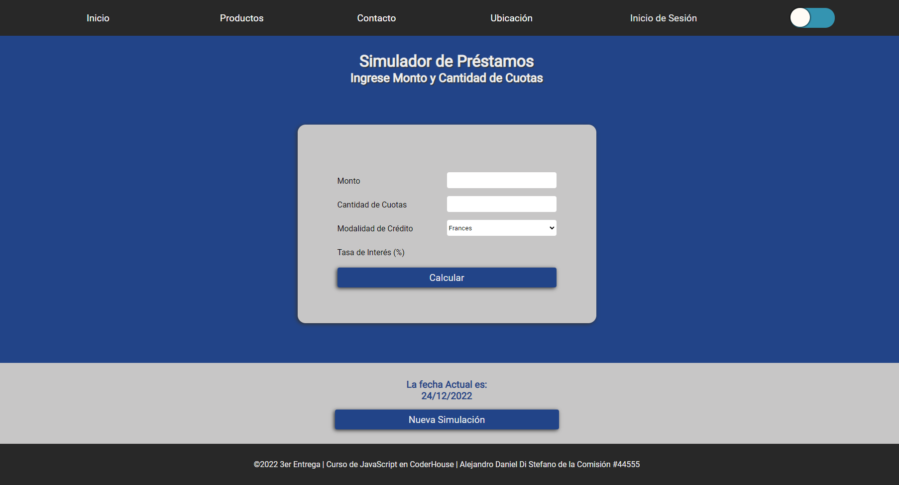
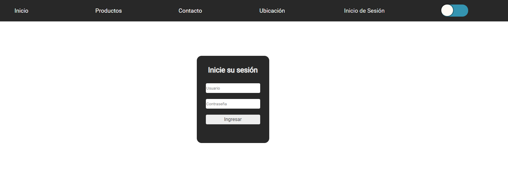

# Entrega parcial del Proyecto Final de JavaScript

---

<p align="center"> 
<a href="https://developer.mozilla.org/en-US/docs/Web/JavaScript" target="_blank"> </a> 
 <a href="https://www.w3.org/html/" target="_blank"> </a> <a href="https://www.w3schools.com/css/" target="_blank"> </a> <a href="https://www.w3.org/sass/" target="_blank"></a>
</p>


---


## Temas Incluidos


### 1er Entrega


```ssh
 1. Conceptos generales: Sintaxis y variables
 
 2. Control de flujos
 
 3. Ciclos e iteraciones
 
 4. Funciones 
```


### 2da Entrega


```ssh
 5. Objetos
 
 6. Arrays
 
 7. Funciones de orden superior
 
 8. DOM 
```


### 3er Entrega


```ssh
 9. Eventos
 
 10. Storage & JSON
 
 11. Workshop
 
 12. Operadores avanzados 
```

### 4ta Entrega


```ssh
 13. Librerías
 
 14. Asincronía y promesas
 
 15. Ajax & Fetch
 
 16. Frameworks & NodeJS
```


## Entrega Final:


### Proyecto Integrador que Incluya todos los Temas vistos en el Curso.


---


### Imagenes de ésta entrega:


<div align="center" ><br>

<br>

<br>

<br>
 </div>


---

## Autor: Alejandro Daniel Di Stefano
